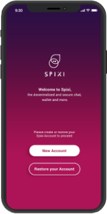

    <h1 class="text-center downloadsTitle">How to use Spixi</h1>
    

        Thank you for trying Spixi. This guide will help you get started with our decentralized messenger and wallet.
    

    

    

        <h2>Creating a new account</h2>
        

            
1

            
            
When you run Spixi for the first time, tap the "New Account" button.

        

        

        <h2>Restoring your existing account</h2>
    

    

