

    <h1 class="text-center downloadsTitle">How to use Spixi</h1>
    

        Thank you for trying Spixi. This guide will help you get started with our decentralized messenger and wallet.
    

    

    <h2 class="guide">Creating a new account</h2>
    

        

            
1

            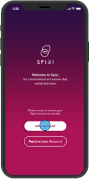
            
When you run Spixi for the first time, tap the "New Account" button.

        

        

            
2

            
            
You will need to set your Nickname. Optionally you can add a custom avatar to be displayed.

            

                <strong>Please note: </strong>
                that this is only your displayed name to other Spixi users and it is not your "handle". You can always change your Nickname in the settings.
            

        

        

            
3

            
            
To finish creating your account, enter your encryption password.

            

                <strong>Please note: </strong>
                that the encryption password will be used to encrypt your Account/Wallet.
                Should you ever lose your device or need to restore your Spixi Account/Wallet, you will need it along with the Backup File.
                You can change this password in the settings menu.
            

        

    

    

    <h2 class="guide">Restoring your existing account</h2>
    

        

            
1

            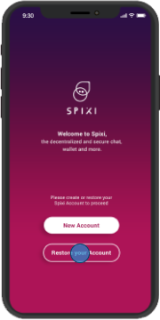
            
Tap the "Restore your Account" button to restore your existing Spixi Account.

        

        

            
2

            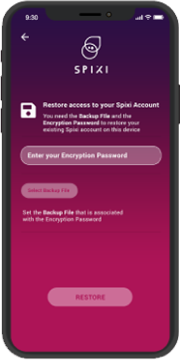
            
Enter the encryption password and select the Backup File that is associated with it. Tap "Restore" button to finish restoring your Spixi Account.

        

        

            
3

            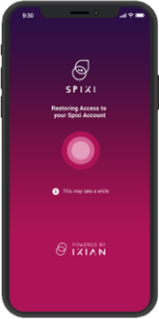
            
Your Spixi Account is now being restored. You should be ready to go in no time.

        

    

    

    <h2 class="guide">Spixi overview</h2>
    

        

            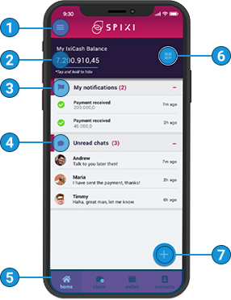
        

        

            

                

                    
1

                    Menu
                

                

                    Opens the <strong>Menu</strong> sidebar
                

            

            

                

                    
2

                    IxiCash Balance
                

                

                    Displays your current <strong>IxiCash balance</strong>
                

            

            

                

                    
3

                    Notification Area
                

                

                    Displays your <strong>unread notifications</strong>
                

            

            

                

                    
4

                    Unread Chats Area
                

                

                    Displays new <strong>unread chats</strong>
                

            

            

                

                    
5

                    App Navigation
                

                

                    Allows you to <strong>quickly navigate</strong> through your Home, Chats, Wallet and Contacts screen
                

            

            

                

                    
6

                    "Quick Scan" Button
                

                

                    Turns on the QR scanner. By scanning a Spixi QR code you can quickly <strong>add a new contact</strong> or <strong>send a payment</strong> in IxiCash
                

            

            

                

                    
7

                    "Action" Button
                

                

                    The Action button brings up a dialog box, which allows you to: 
                    - add a <strong>new contact</strong> 
                    - start <strong>new chat</strong> 
                    - <strong>send IxiCash</strong> payment 
                    - <strong>request IxiCash</strong> payment 
                

            

        

    

    

    <h2 class="guide">Menu overview</h2>
    

        

            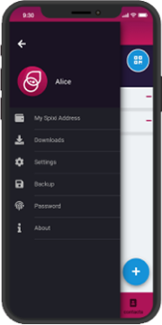
            
The sidebar menu will provide access to various settings including your Spixi Address.

        

        

            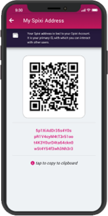
            
"My Spixi Address" screen will display your address along with the QR code. This address is used to identify your account and wallet. Other people can add you as their contact or send you IxiCash by using this address.

        

        

            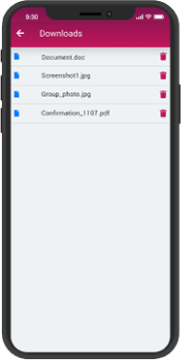
            
All files that you received via Spixi are neatly kept on your "Downloads" screen. Access, view and delete these files with ease.

        

        

            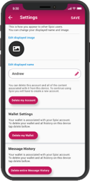
            
On "Settings" screen you can change your displayed image and name. You also have the possibility to delete your accont and/or wallet.

            

                Please note that this is only your displayed name to other Spixi users and it is not your "handle". You can always chanage your Nickname in the settings.
            

        

        

            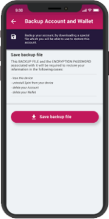
            
Backing up your Spixi Account and Wallet is important!
                In case you lose your device or lose access to your account, you will not be able to restore it without the Backup File and the Encryption Password.
                Download the backup file and keep it safe.
            

        

        

            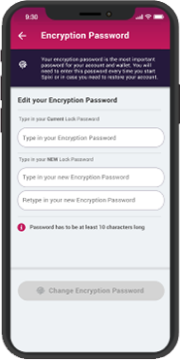
            
You can change your Encryption Password easily.
                Please keep in mind that this password is required along with the backup file to restore access to your Spixi account.
            

        

    

    

