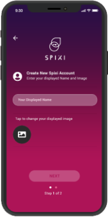
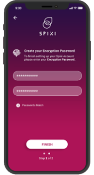

    <h1 class="text-center downloadsTitle">How to use Spixi</h1>
    

        Thank you for trying Spixi. This guide will help you get started with our decentralized messenger and wallet.
    

    

    <h2 class="guide">Creating a new account</h2>
    

        

            
1

            
            
When you run Spixi for the first time, tap the "New Account" button.

        

        

            
2

            
            
You will need to set your Nickname. Optionally you can add a custom avatar to be displayed.

            

                <strong>Please note: </strong>
                that this is only your displayed name to other Spixi users and it is not your "handle". You can always change your Nickname in the settings.
            

        

        

            
3

            
            
To finish creating your account, enter your encryption password.

            

                <strong>Please note: </strong>
                that the encryption password will be used to encrypt your wallet.
                Should you ever lose your device or need to restore your Spixi Wallet/Account, you will need it along with the Backup File.
                You can change this password in the settings menu.
            

        

    

    

    <h2>Restoring your existing account</h2>
    

