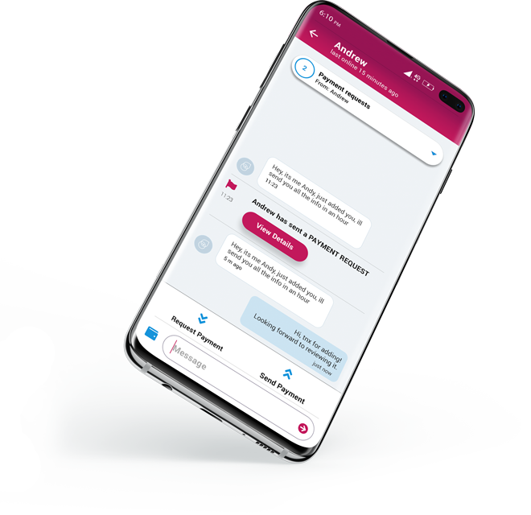
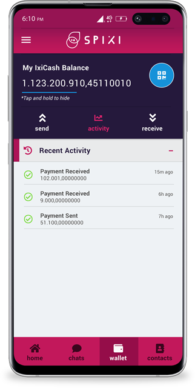

    <h2 class="text-center" style="font-family: Roboto, sans-serif;font-size: 36px;font-weight: 300;padding-top: 80px;color: #540b2e;">What makes SPIXI instant messenger so special</h2>
    
Spixi is a next generation instant messenger. It utilizes blockchain technology to provide a secure and private chat experience. No verification, no phone number and no personal data are required to use Spixi.

    
    

        <h2 class="text-center">Key Features of Spixi IM</h2>
    

    

        

            <h2>Always online</h2>
            
The decentralized architecture behind Spixi allows for a no downtime service. As long as you and your counterpart have internet connection, you will always be able to chat and exchange data. There are no central points of failure.

            <h2>Security and Privacy</h2>
            
Data, which is transferred between users is stored locally on the user's device. By using state-of-the-art encryption methods, SPIXI is ideal for corporations, governments, enterprises and users who value privacy and security.
                It's the perfect tool when these requirements are essential.

        

        

    

    
    

        

        

            <h2 style="font-size: 24px;color: #a71e5a;padding-left: 20px;font-weight: bold;padding-top: 40px;padding-bottom: 0;">IxiCash Wallet</h2>
            
Spixi Instant Messenger includes a secure and easy to use cryptocurrency wallet. Use it to send and receive IxiCash as easy as sending a message.

            

                
<i class="fas fa-exchange-alt"></i>

                
<strong>Send and receive IxiCash</strong>

            

            

                
<i class="fas fa-chart-line"></i>

                
<strong>Monitor your balance and activity</strong>

            

            

                
<i class="fas fa-qrcode"></i>

                
<strong>Generate new addresses</strong>

            

            

                
<i class="fas fa-percentage"></i>

                
<strong>Set transaction fee policy</strong>

            

            

                
<i class="fas fa-check-double"></i>

                
<strong>Send multiple payments within a single transaction</strong>

            

        

    

    

        
Download Spixi for Android devices and Windows PC. Chat with friends and family, and send or receive IxiCash to your wallet.
<a href="/download.html" style="z-index:100;"><button class="btn btn-primary text-left radial-fill" type="button">Download SPIXI now</button></a>
        

        

    

    <h2 class="text-center">Development Roadmap</h2>
    
 Spixi is now available for use. We are constantly developing Spixi and adding new features. The future updates will include some major features such as file transfer, voice and video chat and group messaging.  

    

        

            
<i class="fas fa-file-export"></i>

            <strong>File transfer</strong>
            
Send or receive data, images and videos. Spixi will provide all data transfer functions that you would expect from an instant messenger.  

        

        

            
<i class="fas fa-phone"></i>

            <strong>Voice Chat</strong>
            
Perform voice calls. Utilize the decentralized network for private and secure conversations with your friends and family.

        

        

            
<i class="fas fa-users"></i>

            <strong>Group Messaging</strong>
            
Create or join group messages, organize your friends, coworkers and family. Make the most of your Spixi experience.

        

    

